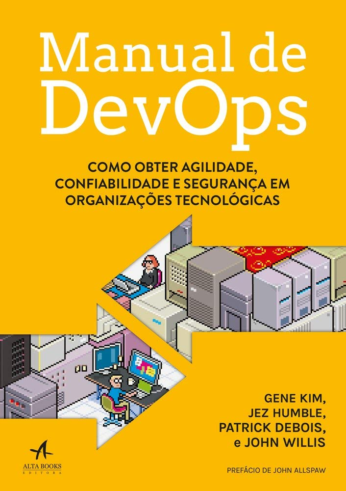
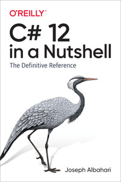
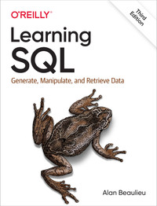
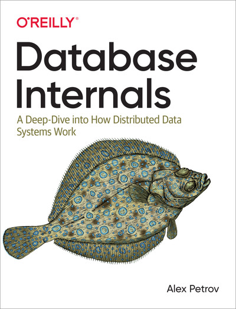
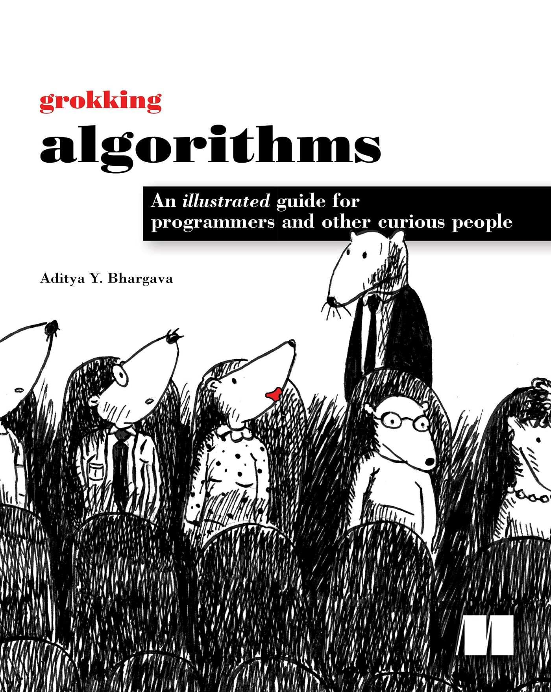
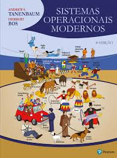
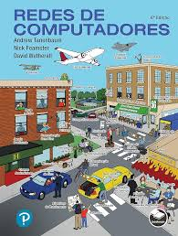

# 👩🏻‍💻 Rafael Abras

**`DevOps e Backend`**

Me chamo Rafael Abras, tenho 18 anos e sou natural de Minas Gerais. Atualmente curso Engenharia de Software pela PUC Minas, além de ter completado o curso AWS re/Start pela Escola da Nuvem e cursar a trilha de extensão AWS Developer. Sou apaixonado por tecnologia e tenho curiosidade e paixão pelo ciclo de um software desde o código até o deploy e System Design.

---

### 🤖 Linguagens e Tecnologias

 
 

## Atualmente estudando
 - Continuamente DevOps e AWS
 - Azure
 - Aprofundando em C#
 - Bash

### Certificações

- AWS Cloud Praticioner

### 📖 Livros que estou lendo atualmente 📚

<table>
<tr>
<td align="center" colspan="5"></td>
</tr>
<tr>
<td>

</td>
<td>

</td>
    <td>

</td>
    <td>

</td>
        <td>

</td>
</table>

### 📖 Livros que pretendo ler 📚

<table>
<tr>
<td align="center" colspan="5"></td>
</tr>
<tr>
<td>

</td>
<td>

</td>
</table>

